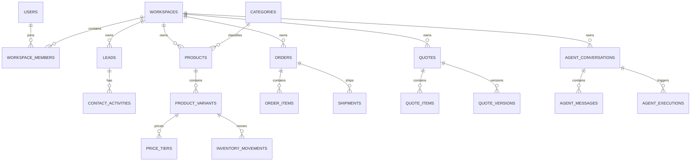

# Mekyro MySQL 数据库结构设计

## 1. 文档范围

本文档描述 Mekyro 当前 MySQL 数据库结构。数据库结构由 SQLAlchemy ORM 和 Alembic 管理，当前迁移版本为 `0004_lead_platform_name`。

- 数据库：MySQL 8.0
- 字符集：`utf8mb4`
- 排序规则：业务字符串主要使用 `utf8mb4_bin`
- 主键策略：业务表统一使用 `varchar(36)` UUID
- 租户隔离：主要业务表通过 `workspace_id` 归属工作区
- 删除策略：外键根据业务关系使用 `CASCADE`、`SET NULL` 或 `RESTRICT`
- 时间字段：统一使用 `created_at`、`updated_at` 等 `datetime` 字段
- 结构基线：[mekyro-mysql-current-complete-commented.sql](../database/schema/mekyro-mysql-current-complete-commented.sql)

当前基线数据只包含：

1. 平台管理员 `mekyro`，密码仅保存 Argon2id 哈希。
2. `上海芒可忆` 工作区。
3. 平台管理员与该工作区的 `owner` 成员关系。

线索、商品、库存、订单、询盘、报价和 Agent 运行记录等业务表在基线 SQL 中保持为空。

## 2. 设计原则

### 2.1 工作区隔离

`workspaces` 是租户根实体。线索、商品、SKU、库存、订单、报价、Agent 会话等数据都直接或间接关联工作区。API 必须在服务端校验当前用户是否拥有目标工作区权限，不能只依赖前端传入的 `workspace_id`。

### 2.2 UUID 主键

所有业务实体继续使用 UUID，不改为 MySQL 自增 ID。这样可以避免跨环境导入、异步写入、外部 API 同步和多节点生成 ID 时发生冲突。

### 2.3 软删除与审计

商品和 SKU 使用 `is_deleted`、`deleted_at` 实现回收站。关键平台操作通过 `audit_logs` 记录，异步事件通过 `outbox_messages` 保证业务事务与消息投递的一致性。

### 2.4 JSON 扩展字段

结构变化频繁、适合整体读写的数据使用 JSON，例如：

- `workspaces.onboarding_state`：入驻流程状态。
- `products.specification_template`：商品规格模板。
- `product_variants.specifications`：SKU 规格值。
- `external_ids`：外部系统 ID 映射。
- Agent 工具输入、输出及事件载荷。

核心查询条件、状态和关联关系仍使用普通字段，避免把高频筛选数据全部放入 JSON。

## 3. 核心关系



## 4. 表分组说明

### 4.1 用户与工作区

| 表名 | 用途 | 关键字段 |
|---|---|---|
| `users` | 系统登录用户 | `username`、`email`、`password_hash`、`is_platform_admin` |
| `workspaces` | 租户、供应商资料与 Agent 配置根实体 | `name`、`slug`、`site_type`、`prompt`、`onboarding_state` |
| `workspace_members` | 用户与工作区多对多成员关系 | `workspace_id`、`user_id`、`role` |
| `workspace_invitations` | 工作区成员邀请 | `email`、`token_hash`、`status`、`expires_at` |
| `workspace_prompt_versions` | 工作区提示词历史版本 | `version`、`prompt`、`daily_lead_limit` |

约束要点：

- `users.username`、`users.email` 唯一。
- `workspaces.slug` 唯一。
- `workspace_members(workspace_id, user_id)` 唯一。
- 密码、邀请令牌和 API Key 只保存哈希或加密值，不保存明文。

### 4.2 认证、授权与审计

| 表名 | 用途 | 关键字段 |
|---|---|---|
| `auth_challenges` | 邮箱、短信验证码挑战 | `channel`、`target`、`code_hash`、`expires_at` |
| `api_keys` | 工作区外部 API 调用密钥 | `key_hash`、`key_prefix`、`permissions` |
| `audit_logs` | 平台和工作区审计日志 | `actor_user_id`、`action`、`entity_type`、`payload` |
| `idempotency_records` | 防止接口重复写入 | `workspace_id`、`scope`、`key`、`request_hash` |
| `outbox_messages` | 事务性异步事件 | `topic`、`deduplication_key`、`status`、`attempts` |

### 4.3 线索与联系记录

| 表名 | 用途 | 关键字段 |
|---|---|---|
| `leads` | 工作区销售线索 | `source`、`platform_name`、`external_ref`、`stage`、`recommendation_score` |
| `contact_activities` | 线索联系和跟进记录 | `lead_id`、`activity_type`、`direction`、`channel`、`content` |

`leads.platform_name` 用于记录具体平台名称，例如 WhatsApp、LinkedIn。`source` 表示来源类别，`platform_name` 表示更具体的平台，两者不应混用。

### 4.4 商品、SKU 与库存

| 表名 | 用途 | 关键字段 |
|---|---|---|
| `categories` | 工作区商品分类树 | `parent_id`、`name`、`sort_order` |
| `products` | 商品主数据 | `category_id`、`name`、`specification_template`、`is_deleted` |
| `product_variants` | SKU 数据 | `product_id`、`sku_code`、`specifications`、`stock_quantity` |
| `price_tiers` | SKU 阶梯价格 | `variant_id`、`minimum_quantity`、`unit_price` |
| `product_images` | 商品或 SKU 图片 | `product_id`、`variant_id`、`image_type`、`file_key` |
| `inventory_movements` | 库存变动流水 | `variant_id`、`quantity_delta`、`balance_after`、`reference` |

库存数量以 `product_variants.stock_quantity` 为当前快照，以 `inventory_movements` 为可追溯流水。出入库操作必须在同一事务中更新两者。

### 4.5 订单、报价与发货

| 表名 | 用途 | 关键字段 |
|---|---|---|
| `orders` | 销售订单主表 | `order_number`、`total_amount`、`order_status`、`payment_status` |
| `order_items` | 订单 SKU 明细 | `order_id`、`variant_id`、`quantity`、`unit_price` |
| `shipments` | 订单发货记录 | `carrier`、`tracking_number`、`shipping_status` |
| `quotes` | 报价单主表 | `quote_number`、`current_version`、`status`、`total_amount` |
| `quote_items` | 当前报价明细 | `quote_id`、`sku_code`、`quantity`、`line_total` |
| `quote_versions` | 报价历史快照 | `version_number`、`items_snapshot`、`total_amount` |

订单编号和报价编号在工作区范围内唯一。金额字段统一使用定点小数，禁止使用浮点类型。

### 4.6 官网询盘

| 表名 | 用途 | 关键字段 |
|---|---|---|
| `supplier_inquiries` | 官网供应商入驻询盘 | `company_name`、`main_business`、`contact_name`、`status` |
| `buyer_inquiries` | 官网买家采购询盘 | `required_product`、`assigned_workspace_id`、`status` |

买家询盘可以先不分配工作区，运营人员处理后再写入 `assigned_workspace_id`。

### 4.7 Shopify 集成

| 表名 | 用途 | 关键字段 |
|---|---|---|
| `shopify_configs` | 工作区 Shopify 接入配置 | `store_url`、`api_version`、`api_key_encrypted`、`is_active` |

每个工作区最多一条 Shopify 配置。API Key 和 Secret 必须加密存储，接口响应只返回掩码值。

### 4.8 Agent 与 AI 执行

| 表名 | 用途 | 关键字段 |
|---|---|---|
| `agent_conversations` | 工作区用户的 Agent 会话 | `workspace_id`、`user_id`、`status` |
| `agent_messages` | 对话消息及结构化事件 | `role`、`content`、`event_type`、`event_payload` |
| `agent_executions` | Agent 工具调用执行 | `execution_key`、`tool_name`、`tool_input`、`result_payload` |
| `agent_approvals` | 高风险写操作审批 | `execution_id`、`requested_by`、`status`、`expires_at` |

Agent 的查询可以直接执行；创建、修改、删除等高风险业务写操作应通过 `agent_approvals` 完成用户确认。`execution_key` 和审批表的一对一约束用于避免重复执行。

### 4.9 迁移版本

| 表名 | 用途 | 关键字段 |
|---|---|---|
| `alembic_version` | 记录当前 Alembic 迁移版本 | `version_num` |

禁止手工修改 `alembic_version`。结构升级必须通过 Alembic migration 执行。

## 5. 索引与约束策略

- 所有主键均建立主键索引。
- 高频租户查询字段 `workspace_id` 建立普通索引。
- 唯一业务编号采用工作区联合唯一约束，例如订单编号、报价编号、SKU 编码。
- 状态、创建时间等列表筛选字段按实际查询组合建立联合索引。
- 外键用于保证工作区、用户、商品、SKU、订单和报价之间的引用完整性。
- JSON 字段当前不承担高频过滤；后续若需要按 JSON 内容筛选，应增加生成列和索引。

## 6. 初始化与恢复

完整基线 SQL：

```text
database/schema/mekyro-mysql-current-complete-commented.sql
```

导入前应确认目标库为空，避免覆盖已有生产数据：

```bash
mysql --default-character-set=utf8mb4 \
  -h <host> -P 3306 -u <user> -p \
  <database> < database/schema/mekyro-mysql-current-complete-commented.sql
```

导入后至少检查：

```sql
SELECT version_num FROM alembic_version;
SELECT COUNT(*) FROM information_schema.tables WHERE table_schema = DATABASE();
SELECT id, username, is_platform_admin FROM users;
SELECT id, name, slug FROM workspaces;
SELECT workspace_id, user_id, role FROM workspace_members;
```

预期迁移版本为 `0004_lead_platform_name`，表数量为 `32`。

## 7. 变更规范

1. ORM 模型、Alembic migration、SQL 基线和本文档需要同步更新。
2. 生产环境先备份，再执行 migration；禁止直接删除数据卷。
3. 新字段必须明确是否允许为空、默认值、索引需求和历史数据回填方式。
4. 新增外键前必须清理孤儿数据。
5. 密钥、密码、验证码等敏感数据禁止以明文进入 SQL、日志或 Git。
6. 业务数据迁移与结构迁移分开执行，便于回滚和审计。
